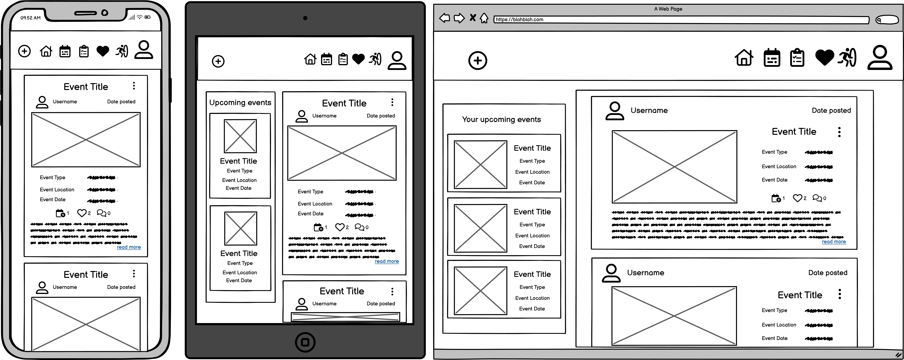
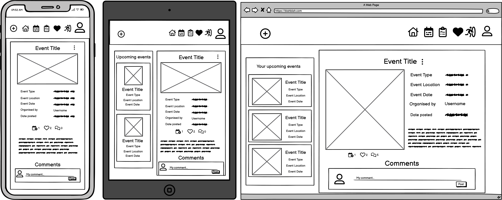
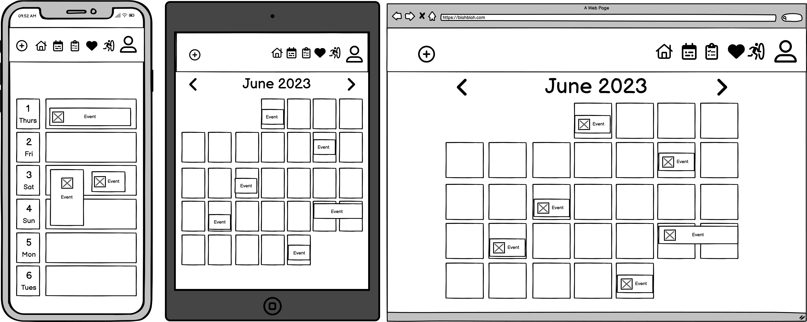

# organisation_app_api

# User Stories

For backend:

| Category             | as a    | I want to                      | so that I can                                                                                                 | mapping API feature |
| -------------------- | ------- | ------------------------------ | ------------------------------------------------------------------------------------------------------------- | ------------------- |
| Account registration | visitor | register for an account        | have a user profile with picture and have full access to the site, make, comment on and like posts and events |                     |
| Posts                | visitor | view a list of posts           | view recent uploads and decide if I want to sign up                                                           |                     |
|                      | visitor | view individual posts          | read the post in more detail and see the associated comments                                                  |                     |
|                      | user    | create new posts               |                                                                                                               |                     |
|                      | user    | edit and delete my own posts   |                                                                                                               |                     |
|                      | user    | like other user's posts        |                                                                                                               |                     |
|                      | user    | unlike other user's posts      |                                                                                                               |                     |
|                      | user    | comment on other user's posts  |                                                                                                               |                     |
|                      | user    | edit and delete my comments    |                                                                                                               |                     |
|                      | user    |                                |                                                                                                               |                     |
|                      | user    |                                |                                                                                                               |                     |
| Events               | visitor | view public events             | see what events are planned and see if I would like to create an account to add the event(s) to my calendar   |                     |
|                      | visitor | view individual events         | see more detail about the event and see any associated comments                                               |                     |
|                      | user    | create new events              |                                                                                                               |                     |
|                      | user    | edit and delete my own events  |                                                                                                               |                     |
|                      | user    | like other user's events       |                                                                                                               |                     |
|                      | user    | comment on other user's events |                                                                                                               |                     |
|                      | user    | add events to my calendar      |                                                                                                               |                     |
|                      | user    | remove events from my calendar |                                                                                                               |                     |
|                      | user    |                                |                                                                                                               |                     |
|                      | user    |                                |                                                                                                               |                     |

# Wireframes

# API Entity Relationship Diagram

# API Endpoints

## Profiles

| HTTP | URI            | CRUD Operation              | View name |
| ---- | -------------- | --------------------------- | --------- |
| GET  | /profiles/     | list all profiles           | LIST      |
| GET  | /profile/{id}/ | retrieve a specific profile | DETAIL    |
| PUT  | /profile/{id}/ | update a specific profile   | DETAIL    |

## Events

| HTTP   | URI               | CRUD Operation                       | View name |
| ------ | ----------------- | ------------------------------------ | --------- |
| GET    | /events/          | list all events                      | LIST      |
| POST   | /events/          | create an event entry                | LIST      |
| GET    | /event/{id}/      | retrieve a specific event entry      | DETAIL    |
| PUT    | /event/{id}/      | update a specific event entry        | DETAIL    |
| DELETE | /event/{id}/      | delete a specific event entry        | DETAIL    |
| GET    | /events/times/    | list all event times                 | LIST      |
| POST   | /events/times/    | create an event time entry           | LIST      |
| GET    | /event/{id}/time/ | retrieve a specific event time entry | DETAIL    |
| PUT    | /event/{id}/time/ | update a specific event time entry   | DETAIL    |
| DELETE | /event/{id}/time/ | delete a specific event time entry   | DETAIL    |

## Posts

| HTTP   | URI         | CRUD Operation           | View name |
| ------ | ----------- | ------------------------ | --------- |
| GET    | /posts/     | list all posts           | LIST      |
| POST   | /posts/     | create a post            | LIST      |
| GET    | /post/{id}/ | retrieve a specific post | DETAIL    |
| PUT    | /post/{id}/ | update a specific post   | DETAIL    |
| DELETE | /post/{id}/ | delete a specific post   | DETAIL    |

## Comments

| HTTP   | URI            | CRUD Operation              | View name |
| ------ | -------------- | --------------------------- | --------- |
| GET    | /comments/     | list all comments           | LIST      |
| POST   | /comments/     | create a comment            | LIST      |
| GET    | /comment/{id}/ | retrieve a specific comment | DETAIL    |
| PUT    | /comment/{id}/ | update a specific comment   | DETAIL    |
| DELETE | /comment/{id}/ | delete a specific comment   | DETAIL    |

## Likes

| HTTP   | URI         | CRUD Operation           | View name |
| ------ | ----------- | ------------------------ | --------- |
| GET    | /likes/     | list all likes           | LIST      |
| POST   | /likes/     | create a like            | LIST      |
| GET    | /like/{id}/ | retrieve a specific like | DETAIL    |
| DELETE | /like/{id}/ | delete a specific like   | DETAIL    |

## Memories

| HTTP   | URI           | CRUD Operation             | View name |
| ------ | ------------- | -------------------------- | --------- |
| GET    | /memories/    | list all memories          | LIST      |
| POST   | /memories/    | create a memory            | LIST      |
| GET    | /memory/{id}/ | retrieve a specific memory | DETAIL    |
| PUT    | /memory/{id}/ | update a specific memory   | DETAIL    |
| DELETE | /memory/{id}/ | delete a specific memory   | DETAIL    |

## Followers

| HTTP   | URI             | CRUD Operation               | View name |
| ------ | --------------- | ---------------------------- | --------- |
| GET    | /followers/     | list all followers           | LIST      |
| POST   | /followers/     | create a follower            | LIST      |
| GET    | /follower/{id}/ | retrieve a specific follower | DETAIL    |
| PUT    | /follower/{id}/ | update a specific follower   | DETAIL    |
| DELETE | /follower/{id}/ | delete a specific follower   | DETAIL    |

## Calendars

| HTTP | URI             | CRUD Operation               | View name |
| ---- | --------------- | ---------------------------- | --------- |
| GET  | /calendars/     | list all calendars           | LIST      |
| GET  | /calendar/{id}/ | retrieve a specific calendar | DETAIL    |
| PUT  | /calendar/{id}/ | update a specific calendar   | DETAIL    |

# References

Creating events in google calendar: https://developers.google.com/calendar/api/guides/create-events
