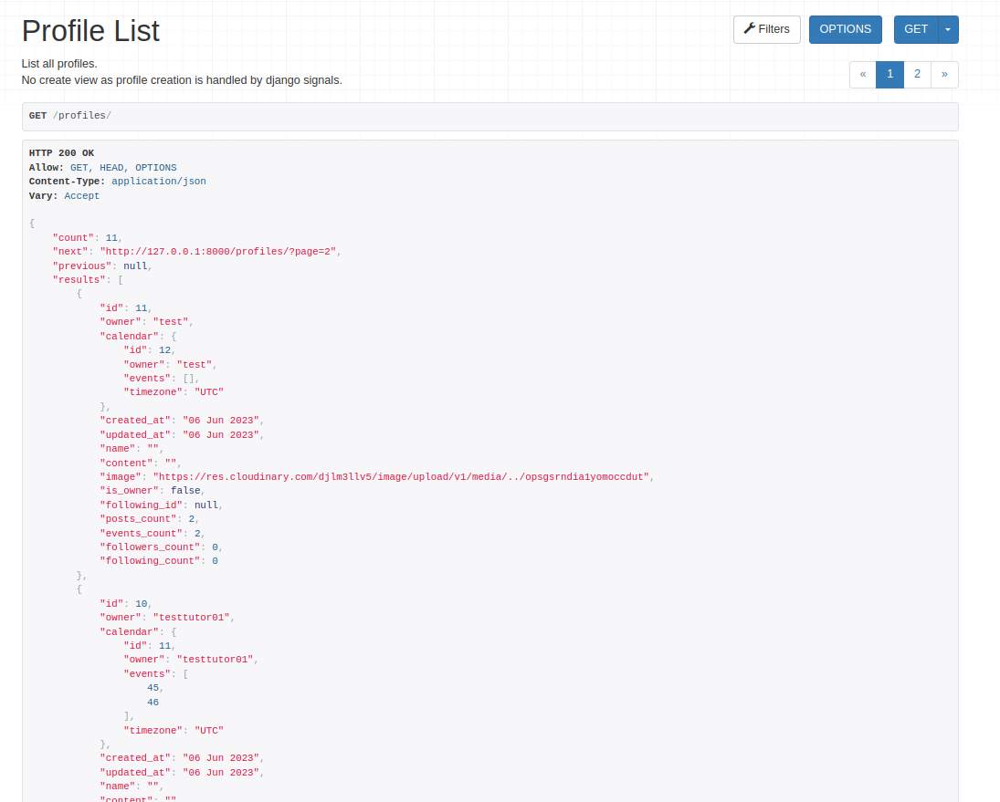
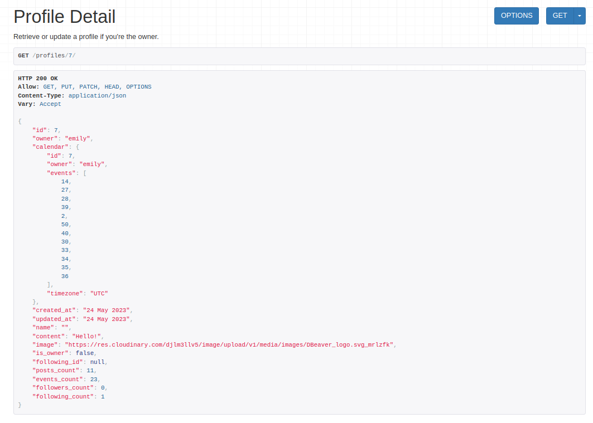
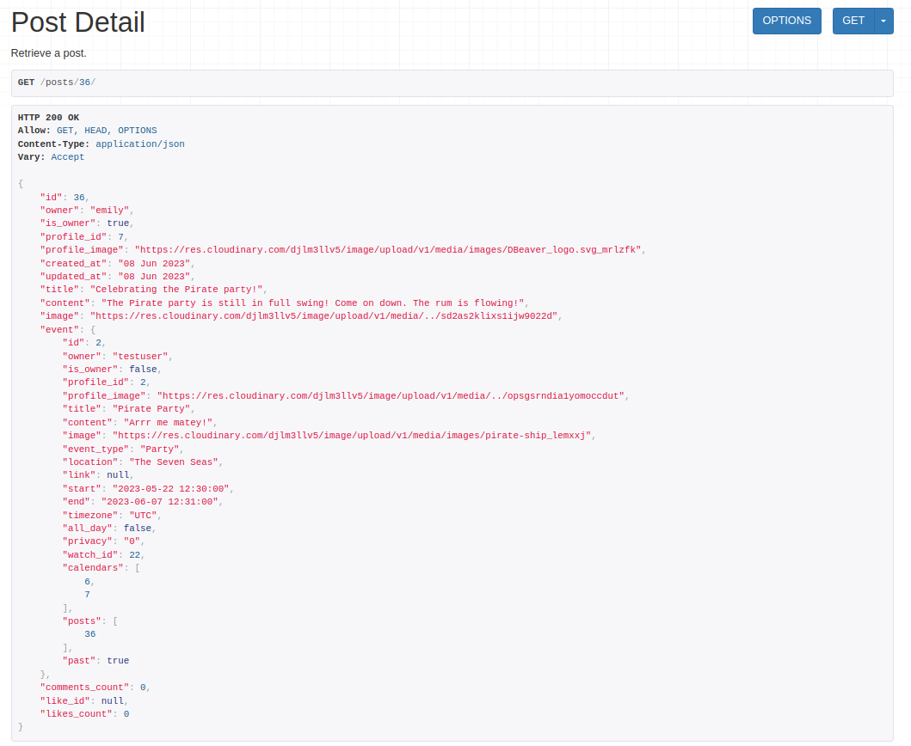
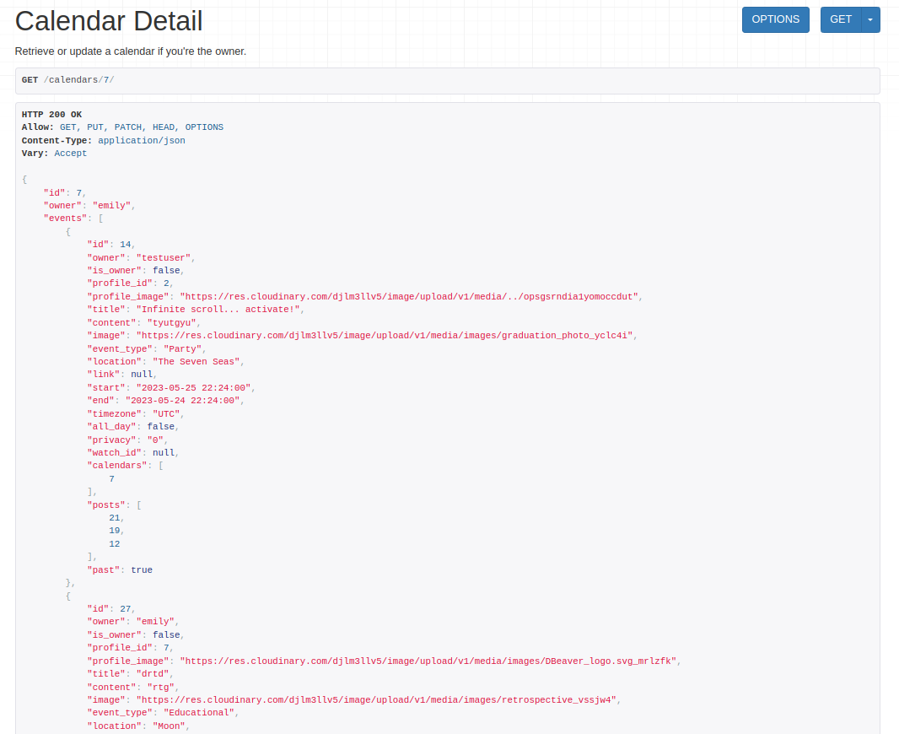
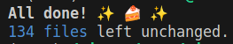

# EventTrove

EventTrove is a one-stop location for all your event discovery, sharing and organisation needs!
This interactive platform includes the option to view, add, edit and delete events and posts to share all kinds of events, big and small! A built in calendar allows visual organisation of your events to make sure you never miss an event!

The project has been split into two parts - the back-end constructed with [Django REST Framework](https://www.django-rest-framework.org/) and the frontend supercharged with [React](https://react.dev/).

More information on the front-end of the site can be found in the [front-end README](https://github.com/dragon-fire-fly/organisation_app_frontend).

Link to the live site - [EventTrove Live Site](https://organisation-app-frontend.herokuapp.com/)

Link to the live API - [EventTrove Live API](https://organisation-app-api.herokuapp.com/)

Link to the front-end repository - [EventTrove Back-End Repo](https://github.com/dragon-fire-fly/organisation_app_frontend)

## User Stories

For backend:

| Category             | as a    | I want to                      | so that I can                                                                                                 | mapping API feature |
| -------------------- | ------- | ------------------------------ | ------------------------------------------------------------------------------------------------------------- | ------------------- |
| Account registration | visitor | register for an account        | have a user profile with picture and have full access to the site, make, comment on and like posts and events |                     |
| Posts                | visitor | view a list of posts           | view recent uploads and decide if I want to sign up                                                           |                     |
|                      | visitor | view individual posts          | read the post in more detail and see the associated comments                                                  |                     |
|                      | user    | create new posts               |                                                                                                               |                     |
|                      | user    | edit and delete my own posts   |                                                                                                               |                     |
|                      | user    | like other user's posts        |                                                                                                               |                     |
|                      | user    | unlike other user's posts      |                                                                                                               |                     |
|                      | user    | comment on other user's posts  |                                                                                                               |                     |
|                      | user    | edit and delete my comments    |                                                                                                               |                     |
|                      | user    |                                |                                                                                                               |                     |
|                      | user    |                                |                                                                                                               |                     |
| Events               | visitor | view public events             | see what events are planned and see if I would like to create an account to add the event(s) to my calendar   |                     |
|                      | visitor | view individual events         | see more detail about the event and see any associated comments                                               |                     |
|                      | user    | create new events              |                                                                                                               |                     |
|                      | user    | edit and delete my own events  |                                                                                                               |                     |
|                      | user    | like other user's events       |                                                                                                               |                     |
|                      | user    | comment on other user's events |                                                                                                               |                     |
|                      | user    | add events to my calendar      |                                                                                                               |                     |
|                      | user    | remove events from my calendar |                                                                                                               |                     |
|                      | user    |                                |                                                                                                               |                     |
|                      | user    |                                |                                                                                                               |                     |

## Database Design

### API Entity Relationship Diagram

## Features

Below are all of the valid endpoints for the API, seperated into their respective apps. There are 9 apps in total that each have a set of API endpoints which can be accessed at the URIs listed below.

### Root route

 

More details about the root route

### Profiles

 

More details about Profiles

| HTTP | URI            | CRUD Operation              | View name |
| ---- | -------------- | --------------------------- | --------- |
| GET  | /profiles/     | list all profiles           | LIST      |
| GET  | /profile/{id}/ | retrieve a specific profile | DETAIL    |
| PUT  | /profile/{id}/ | update a specific profile   | DETAIL    |

### Events

 

More details about Events

| HTTP   | URI                     | CRUD Operation                         | View name |
| ------ | ----------------------- | -------------------------------------- | --------- |
| GET    | /events/                | list all events                        | LIST      |
| POST   | /events/                | create an event entry                  | LIST      |
| GET    | /event/{id}/            | retrieve a specific event entry        | DETAIL    |
| PUT    | /event/{id}/            | update a specific event entry          | DETAIL    |
| DELETE | /event/{id}/            | delete a specific event entry          | DETAIL    |
| GET    | /events/calendars/{id}/ | list all events in a specific calendar | LIST      |

Event list route. Authenticated users can also create new events on this route

Event detail route. Event owners can also edit and delete events on this page

Calendar event route. This route is used by the calendar to retrieve all events from a specific calendar

If the route for a non existant event is entered, a 404 error is returned

### Posts

 

More details about Posts

| HTTP   | URI               | CRUD Operation           | View name |
| ------ | ----------------- | ------------------------ | --------- |
| GET    | /posts/           | list all posts           | LIST      |
| POST   | /posts/create/    | create a post            | LIST      |
| GET    | /posts/{id}/      | retrieve a specific post | DETAIL    |
| PUT    | /posts/{id}/edit/ | update a specific post   | DETAIL    |
| DELETE | /posts/{id}/edit/ | delete a specific post   | DETAIL    |

Post list route. This route does not contain the event serializer on the event field. Authenticated users can also create new posts on this route

Event detail route. This route does contains the event serializer on the event field

Post edit and delete route. This route does not contain the event serializer on the event field

If the route for a non existant post is entered, a 404 error is returned

### Comments

 

More details about Comments

| HTTP   | URI             | CRUD Operation              | View name |
| ------ | --------------- | --------------------------- | --------- |
| GET    | /comments/      | list all comments           | LIST      |
| POST   | /comments/      | create a comment            | LIST      |
| GET    | /comments/{id}/ | retrieve a specific comment | DETAIL    |
| PUT    | /comments/{id}/ | update a specific comment   | DETAIL    |
| DELETE | /comments/{id}/ | delete a specific comment   | DETAIL    |

### Likes

 

More details about Likes

| HTTP   | URI          | CRUD Operation           | View name |
| ------ | ------------ | ------------------------ | --------- |
| GET    | /likes/      | list all likes           | LIST      |
| POST   | /likes/      | create a like            | LIST      |
| GET    | /likes/{id}/ | retrieve a specific like | DETAIL    |
| DELETE | /likes/{id}/ | delete a specific like   | DETAIL    |

### Watches

 

More details about Watches

| HTTP   | URI            | CRUD Operation            | View name |
| ------ | -------------- | ------------------------- | --------- |
| GET    | /watches/      | list all watches          | LIST      |
| POST   | /watches/      | create a watch            | LIST      |
| GET    | /watches/{id}/ | retrieve a specific watch | DETAIL    |
| DELETE | /watches/{id}/ | delete a specific watch   | DETAIL    |

### Memories

 

More details about Memories

| HTTP   | URI             | CRUD Operation             | View name |
| ------ | --------------- | -------------------------- | --------- |
| GET    | /memories/      | list all memories          | LIST      |
| POST   | /memories/      | create a memory            | LIST      |
| GET    | /memories/{id}/ | retrieve a specific memory | DETAIL    |
| PUT    | /memories/{id}/ | update a specific memory   | DETAIL    |
| DELETE | /memories/{id}/ | delete a specific memory   | DETAIL    |

### Followers

 

More details about Followers

| HTTP   | URI              | CRUD Operation               | View name |
| ------ | ---------------- | ---------------------------- | --------- |
| GET    | /followers/      | list all followers           | LIST      |
| POST   | /followers/      | create a follower            | LIST      |
| GET    | /followers/{id}/ | retrieve a specific follower | DETAIL    |
| DELETE | /followers/{id}/ | delete a specific follower   | DETAIL    |

### Calendars

 

More details about Calendars

| HTTP | URI              | CRUD Operation               | View name |
| ---- | ---------------- | ---------------------------- | --------- |
| GET  | /calendars/      | list all calendars           | LIST      |
| GET  | /calendars/{id}/ | retrieve a specific calendar | DETAIL    |
| PUT  | /calendars/{id}/ | update a specific calendar   | DETAIL    |

## Testing

### Ci Workflow

A Continuous Integration (CI) workflow was set up on Github actions to monitor the API and run all unittests after each commit.
This enabled early detection of test failures and therefore faster fixture of bugs.

The [workflow file](https://github.com/dragon-fire-fly/organisation_app_api/blob/main/.github/workflows/ci.yml) can be found in the github repository for the project.

### PEP8

All files in the project have been run through the internal pycodestyle linter in VSCode during development.
In addition, the [Black](https://pypi.org/project/black/) pep8 validation tool was used on all files, installed into my VSCode environment throughout the development of the project. The line-length setting for Black was amended to 79 instead of the default 108 to comply with best practices.

To install and run pycode style:

- Run the command 'pip3 install -r requirements.txt'
- Press Ctrl+Shift+P
- Type 'linter' into the search field
- Select 'Python: Select Linter
- Select 'pycodestyle' from the list
- Select the 'Problems' tab in the terminal area at the bottom of the screen
- PEP8 errors are now displayed in the "problems"tab as well as being underlined in red in files themselves

### Security

## References

Creating events in google calendar: https://developers.google.com/calendar/api/guides/create-events

for obtaining user's timezone: https://www.youtube.com/watch?v=lUe_-WnrPUE
