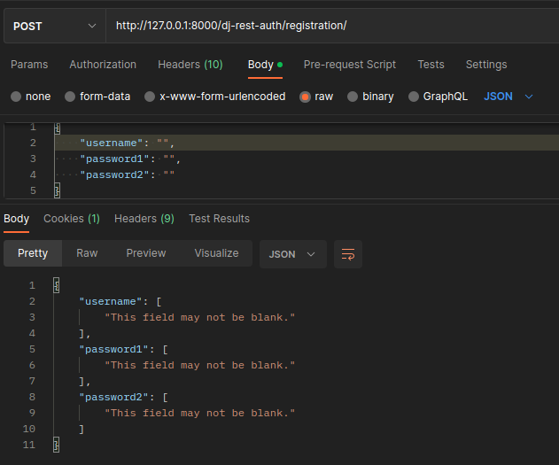

# Testing

## Ci Workflow

A Continuous Integration (CI) workflow was set up on Github actions to monitor the API and run all unittests after each commit.
This enabled early detection of test failures and therefore faster fixture of bugs.

The [workflow file](https://github.com/dragon-fire-fly/organisation_app_api/blob/main/.github/workflows/ci.yml) can be found in the github repository for the project.

## PEP8

All files in the project have been run through the internal pycodestyle linter in VSCode during development.
In addition, the [Black](https://pypi.org/project/black/) pep8 validation tool was used on all files, installed into my VSCode environment throughout the development of the project. The line-length setting for Black was amended to 79 instead of the default 108 to comply with best practices.

To install and run pycode style:

- Run the command 'pip3 install -r requirements.txt'
- Press Ctrl+Shift+P
- Type 'linter' into the search field
- Select 'Python: Select Linter
- Select 'pycodestyle' from the list
- Select the 'Problems' tab in the terminal area at the bottom of the screen
- PEP8 errors are now displayed in the "problems"tab as well as being underlined in red in files themselves

## Manual Testing

Manual testing was performed for the API using Postman.
Postman is...

### Root

### Sign up

| HTTP | URI                        | Testing                      | Response | Screenshot                                                                         |
| ---- | -------------------------- | ---------------------------- | -------- | ---------------------------------------------------------------------------------- |
| GET  | dj-rest-auth/registration/ | not allowed                  | 405      |  |
| POST | dj-rest-auth/registration/ | blank username & password    | 400      |      |
| POST | dj-rest-auth/registration/ | password too short           | 400      |        |
| POST | dj-rest-auth/registration/ | non matching password        | 400      |       |
| POST | dj-rest-auth/registration/ | password similar to username | 400      |    |
| POST | dj-rest-auth/registration/ | password too common          | 400      |      |
| POST | dj-rest-auth/registration/ | valid username & password    | 200      |              |

### Sign in

| HTTP | URI                 | Testing                   | Response | Screenshot                                                                         |
| ---- | ------------------- | ------------------------- | -------- | ---------------------------------------------------------------------------------- |
| GET  | dj-rest-auth/login/ | not allowed               | 405      |  |
| POST | dj-rest-auth/login/ | blank username & password | 400      |      |
| POST | dj-rest-auth/login/ | valid username & password | 200      |               |

To access restricted content using Postman, the JWT token must be supplied in the Authorization tabas a "Bearer Token". On successful signup/sign in, the user's JWT token is displayed. This can be copied into the Authorization tab to access content appropriate for the user's permission state. :

### Profiles

| HTTP | URI             | Testing                       | Response | Screenshot                                                         |
| ---- | --------------- | ----------------------------- | -------- | ------------------------------------------------------------------ |
| GET  | /profiles/      | list view                     | 200      |                     |
| POST | /profiles/      | method not allowed            | 405      |    |
| GET  | /profiles/{id}/ | detail view                   |          |                      |
| PUT  | /profiles/{id}/ | put with unauthenticated user |          |  |
| PUT  | /profiles/{id}/ | put with validated user       |          |                                  |

### Posts

| HTTP   | URI               | Testing                               | Response | Screenshot                                                         |
| ------ | ----------------- | ------------------------------------- | -------- | ------------------------------------------------------------------ |
| GET    | /posts/           | list view                             | 200      |            |
| POST   | /posts/           | method not allowed                    | 405      |       |
| POST   | /posts/create/    | unauthenticated user not able to post | 401      |  |
| POST   | /posts/create/    | authenticated user able to post       | 201      |          |
| GET    | /posts/{id}/      | detail view                           | 200      |              |
| PUT    | /posts/{id}/edit/ | put with unauthenticated user         | 401      |     |
| PUT    | /posts/{id}/edit/ | put with valid user                   | 200      |             |
| DELETE | /posts/{id}/edit/ | delete with unauthenticated user      | 401      |     |
| DELETE | /posts/{id}/edit/ | delete with valid user                | 204      |          |

### Events

| HTTP   | URI           | Testing                          | Response | Screenshot                                                       |
| ------ | ------------- | -------------------------------- | -------- | ---------------------------------------------------------------- |
| GET    | /events/      | list view                        | 200      |         |
| POST   | /events/      | post with unauthenticated user   | 401      |    |
| POST   | /events/      | post with authenticated user     | 201      |         |
| GET    | /events/{id}/ | detail view                      | 200      |          |
| PUT    | /events/{id}/ | put with unauthenticated user    | 401      |     |
| PUT    | /events/{id}/ | put with valid user              | 200      |          |
| DELETE | /posts/{id}/  | delete with unauthenticated user | 401      |  |
| DELETE | /posts/{id}/  | delete with valid user           | 204      |       |

### Calendars

| HTTP   | URI     | Testing                          | Response | Screenshot                         |
| ------ | ------- | -------------------------------- | -------- | ---------------------------------- |
| GET    | //      | list view                        | 200      |  |
| POST   | //      | post with unauthenticated        | 401      |  |
| POST   | //      | post with authenticated user     | 201      |  |
| GET    | //{id}/ | detail view                      | 200      |  |
| PUT    | //{id}/ | put with unauthenticated user    | 401      |  |
| PUT    | //{id}/ | put with valid user              | 200      |  |
| DELETE | //{id}/ | delete with unauthenticated user | 401      |  |
| DELETE | //{id}/ | delete with valid user           | 204      |  |

### Comments

| HTTP   | URI     | Testing                          | Response | Screenshot                         |
| ------ | ------- | -------------------------------- | -------- | ---------------------------------- |
| GET    | //      | list view                        | 200      |  |
| POST   | //      | post with unauthenticated        | 401      |  |
| POST   | //      | post with authenticated user     | 201      |  |
| GET    | //{id}/ | detail view                      | 200      |  |
| PUT    | //{id}/ | put with unauthenticated user    | 401      |  |
| PUT    | //{id}/ | put with valid user              | 200      |  |
| DELETE | //{id}/ | delete with unauthenticated user | 401      |  |
| DELETE | //{id}/ | delete with valid user           | 204      |  |

### Likes

| HTTP   | URI     | Testing                          | Response | Screenshot                         |
| ------ | ------- | -------------------------------- | -------- | ---------------------------------- |
| GET    | //      | list view                        | 200      |  |
| POST   | //      | post with unauthenticated        | 401      |  |
| POST   | //      | post with authenticated user     | 201      |  |
| GET    | //{id}/ | detail view                      | 200      |  |
| PUT    | //{id}/ | put with unauthenticated user    | 401      |  |
| PUT    | //{id}/ | put with valid user              | 200      |  |
| DELETE | //{id}/ | delete with unauthenticated user | 401      |  |
| DELETE | //{id}/ | delete with valid user           | 204      |  |

### Memories

| HTTP   | URI     | Testing                          | Response | Screenshot                         |
| ------ | ------- | -------------------------------- | -------- | ---------------------------------- |
| GET    | //      | list view                        | 200      |  |
| POST   | //      | post with unauthenticated        | 401      |  |
| POST   | //      | post with authenticated user     | 201      |  |
| GET    | //{id}/ | detail view                      | 200      |  |
| PUT    | //{id}/ | put with unauthenticated user    | 401      |  |
| PUT    | //{id}/ | put with valid user              | 200      |  |
| DELETE | //{id}/ | delete with unauthenticated user | 401      |  |
| DELETE | //{id}/ | delete with valid user           | 204      |  |

### Watches

| HTTP   | URI     | Testing                          | Response | Screenshot                         |
| ------ | ------- | -------------------------------- | -------- | ---------------------------------- |
| GET    | //      | list view                        | 200      |  |
| POST   | //      | post with unauthenticated        | 401      |  |
| POST   | //      | post with authenticated user     | 201      |  |
| GET    | //{id}/ | detail view                      | 200      |  |
| PUT    | //{id}/ | put with unauthenticated user    | 401      |  |
| PUT    | //{id}/ | put with valid user              | 200      |  |
| DELETE | //{id}/ | delete with unauthenticated user | 401      |  |
| DELETE | //{id}/ | delete with valid user           | 204      |  |

### Followers

| HTTP   | URI     | Testing                          | Response | Screenshot                         |
| ------ | ------- | -------------------------------- | -------- | ---------------------------------- |
| GET    | //      | list view                        | 200      |  |
| POST   | //      | post with unauthenticated        | 401      |  |
| POST   | //      | post with authenticated user     | 201      |  |
| GET    | //{id}/ | detail view                      | 200      |  |
| PUT    | //{id}/ | put with unauthenticated user    | 401      |  |
| PUT    | //{id}/ | put with valid user              | 200      |  |
| DELETE | //{id}/ | delete with unauthenticated user | 401      |  |
| DELETE | //{id}/ | delete with valid user           | 204      |  |
