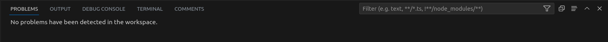

# Testing

[Back to the main README file](README.md)

## Ci Workflow

A Continuous Integration (CI) workflow was set up on Github actions to monitor the API and run all unittests after each commit.
This enabled early detection of test failures and therefore faster fixture of bugs.

The [workflow file](https://github.com/dragon-fire-fly/organisation_app_api/blob/main/.github/workflows/ci.yml) can be found in the github repository for the project.

## PEP8

All files in the project have been run through the internal pycodestyle linter in VSCode during development.
In addition, the [Black](https://pypi.org/project/black/) pep8 validation tool was used on all files, installed into my VSCode environment throughout the development of the project. The line-length setting for Black was amended to 79 instead of the default 108 to comply with best practices.

To install and run pycode style:

- Run the command 'pip3 install -r requirements.txt'
- Press Ctrl+Shift+P
- Type 'linter' into the search field
- Select 'Python: Select Linter
- Select 'pycodestyle' from the list
- Select the 'Problems' tab in the terminal area at the bottom of the screen
- PEP8 errors are now displayed in the "problems"tab as well as being underlined in red in files themselves

## Manual Testing

Manual testing was performed for the API using Postman.
Postman is an API tool that allows routes to be tested from outside the browser. This helps with building and testing of APIs. Here, each possible route was tested with authorised and unauthorised users to check that the correct responses were recieved for each route, depending on the level of permission of the user.

The sign up/sign in and JWT token generation was also tested through the `/dj-rest-auth/registration/` and `dj-rest-auth/login/` routes.

### Root

 

See more

### Sign up

These routes address the following user stories:

- As a **visitor** I can **register for an account** so that **I can have a user profile with picture and have full access to the site, make, comment on and like posts and events**

 

See more

| HTTP | URI                        | Testing                      | Response               | Screenshot                                                                         |
| ---- | -------------------------- | ---------------------------- | ---------------------- | ---------------------------------------------------------------------------------- |
| GET  | dj-rest-auth/registration/ | get method not allowed       | 405 method not allowed |  |
| POST | dj-rest-auth/registration/ | blank username & password    | 400 bad request        |      |
| POST | dj-rest-auth/registration/ | password too short           | 400 bad request        |        |
| POST | dj-rest-auth/registration/ | non matching password        | 400 bad request        |       |
| POST | dj-rest-auth/registration/ | password similar to username | 400 bad request        |    |
| POST | dj-rest-auth/registration/ | password too common          | 400 bad request        |      |
| POST | dj-rest-auth/registration/ | valid username & password    | 201 created            |              |

### Sign in

These routes address the following user stories:

- As a **registered user** I can **log in to my account** so that **I can have full access to the site, make, comment on and like posts and events**

 

See more

| HTTP | URI                 | Testing                   | Response               | Screenshot                                                                         |
| ---- | ------------------- | ------------------------- | ---------------------- | ---------------------------------------------------------------------------------- |
| GET  | dj-rest-auth/login/ | get method not allowed    | 405 method not allowed |  |
| POST | dj-rest-auth/login/ | blank username & password | 400 bad request        |      |
| POST | dj-rest-auth/login/ | valid username & password | 200 success            |               |

To access restricted content using Postman, the JWT token must be supplied in the Authorization tabas a "Bearer Token". On successful signup/sign in, the user's JWT token is displayed. This can be copied into the Authorization tab to access content appropriate for the user's permission state. :

### Profiles

These routes address the following user stories:

- As a **user** I can **view other user's profiles** so that I can **see a specific user's posts and events**
- As a **user** I can **have a profile created for me, add a profile picture and edit my profile** so that **I can have a custom profile picture and display information about myself**

 

See more

| HTTP | URI             | Testing                       | Response               | Screenshot                                                                            |
| ---- | --------------- | ----------------------------- | ---------------------- | ------------------------------------------------------------------------------------- |
| GET  | /profiles/      | list view                     | 200 success            |                           |
| POST | /profiles/      | post method not allowed       | 405 method not allowed |       |
| GET  | /profiles/{id}/ | detail view                   | 200 success            |                      |
| PUT  | /profiles/{id}/ | put with unauthenticated user | 401 unauthorized       |  |

### Posts

These routes address the following user stories:

- As a **user** I can **view specific posts from another user in their profile** so that **I can see that user's post activity**
- As a **visitor** I can **view a list of posts** so that **I can view recent uploads and decide if I want to sign up**
- As a **visitor** I can **view individual posts** so that **I can read the post in more detail and see the associated comments**
- As a **user or visitor** I can **scroll through a list of posts** so that **I can browse the site more comfortably**
- As a **user** I can **create posts** so that **I can share information about events with other users**
- As a **user** I can **edit or delete my own posts** so that **I can fix incorrect information, add more information, or remove the post entirely**
- As a **user** I can **see posts made specifically by my friends** so that **I can easily access the posts most relevant to me**
- As a **user** I can **access a page containing posts I've liked** so that **I can easily find these posts again**
- As a **user** I can **choose an event from my event list when I post** so that **I can make a post about that specific event**

 

See more

| HTTP   | URI               | Testing                                 | Response               | Screenshot                                                                             |
| ------ | ----------------- | --------------------------------------- | ---------------------- | -------------------------------------------------------------------------------------- |
| GET    | /posts/           | list view                               | 200 success            |                   |
| POST   | /posts/           | post method not allowed                 | 405 method not allowed |           |
| POST   | /posts/create/    | unauthenticated user not able to post   | 401 unauthorized       |  |
| POST   | /posts/create/    | authenticated user able to post         | 201 created            |            |
| GET    | /posts/{id}/      | detail view                             | 200 success            |                   |
| PUT    | /posts/{id}/edit/ | put with unauthenticated user           | 401 unauthorized       |      |
| PUT    | /posts/{id}/edit/ | put with valid user (not post owner)    | 403 forbidden          |          |
| PUT    | /posts/{id}/edit/ | put with valid user (post owner)        | 200 success            |                |
| DELETE | /posts/{id}/edit/ | delete with unauthenticated user        | 401 unauthorized       |   |
| DELETE | /posts/{id}/edit/ | delete with valid user (not post owner) | 403 forbidden          |    |
| DELETE | /posts/{id}/edit/ | delete with valid user (post owner)     | 204 no content         |          |

### Events

These routes address the following user stories:

- As a **user** I can **view specific events from another user in their profile** so that **I can see that user's events**
- As a **user** I can **choose an event from my event list when I post** so that **I can make a post about that specific event**
- As a **visitor** I can **view public events** so that **I can see what events are planned and see if I would like to create an account to add the event(s) to my calendar**
- As a **visitor** I can **view individual events** so that **I can see more detail about the event and see any associated comments**
- As a **user or visitor** I can **scroll through a list of events** so that **I can browse the site more comfortably**
- As a **user** I can **create events** so that **I can share information about events with other users**
- As a **user** I can **edit or delete my own events** so that **I can fix incorrect information, add more information, or remove the event entirely**
- As a **user** I can **view my friend's events on a seperate page** so that **I can quickly browse events most relevant to me**
- As a **user** I can **see my upcoming events on a sidebar** so that **I can quickly see which of my events are coming up soon**

 

See more

| HTTP   | URI           | Testing                                  | Response         | Screenshot                                                                             |
| ------ | ------------- | ---------------------------------------- | ---------------- | -------------------------------------------------------------------------------------- |
| GET    | /events/      | list view                                | 200 success      |                  |
| POST   | /events/      | post with unauthenticated user           | 401 unauthorized |      |
| POST   | /events/      | post with authenticated user             | 201 created      |             |
| GET    | /events/{id}/ | detail view                              | 200 success      |                 |
| PUT    | /events/{id}/ | put with unauthenticated user            | 401 unauthorized |        |
| PUT    | /events/{id}/ | put with valid user (not event owner)    | 403 forbidden    |         |
| PUT    | /events/{id}/ | put with valid user (event owner)        | 200 success      |               |
| DELETE | /events/{id}/ | delete with unauthenticated user         | 401 unauthorized |  |
| DELETE | /events/{id}/ | delete with valid user (not event owner) | 403 forbidden    |   |
| DELETE | /events/{id}/ | delete with valid user (event owner)     | 204 no content   |         |

### Calendars

These routes address the following user stories:

- As a **user** I am **automatically assigned a calendar** so that **I can easily view my events**
- As a **user**, **the events I create are automatically added to my calendar** so that **I can immediately visualise them**
- As a **user** I can **add and remove other user's events to/from my calendar** so that **I can visually see when they will take place on my personal calendar**
- As a **user** I can **toggle the view of my calendar between year, month, week and day** so that **I can easily visualise my time and see when events are**
- As a **user** I can **navigate between days, weeks, months and years using directional arrows** so that **I can easily visualise my events in my calendar**
- As a **user** I can **click a day and see the events planned for that day** so that **I can quickly see which (if any) events are taking place on a day**
- As a **user** I have **the option to add an event from my calendar** so that **I can easily create new events**
- As a **user** I can **click an event in my calendar to see the event details** so that **I can easily visualise events in my calendar**
- As a **user** I have **a button to see the specific event when I click in in my calendar** so that **I can view further details, edit and delete it**
- As a **user** I can **syncronise my events with my google calendar** so that **I can keep one universal collection of events wherever I am**

 

See more

| HTTP   | URI              | Testing            | Response               | Screenshot                                                                        |
| ------ | ---------------- | ------------------ | ---------------------- | --------------------------------------------------------------------------------- |
| GET    | /calendars/      | list view          | 200 success            |          |
| GET    | /calendars/{id}/ | detail view        | 200 success            |         |
| DELETE | /calendars/{id}/ | delete not allowed | 405 method not allowed |  |

### Comments

These routes address the following user stories:

- As a **user** I can **create comments on posts** so that **I can communicate with the poster and other users about the post content**
- As a **user** I can **edit and delete my own comments** so that **I can amend or remove the comment I wrote**

 

See more

| HTTP   | URI             | Testing                                    | Response         | Screenshot                                                                               |
| ------ | --------------- | ------------------------------------------ | ---------------- | ---------------------------------------------------------------------------------------- |
| GET    | /comments/      | list view                                  | 200 success      |                  |
| POST   | /comments/      | post with unauthenticated                  | 401 unauthorized |   |
| POST   | /comments/      | post with authenticated user               | 201 created      |             |
| GET    | /comments/{id}/ | detail view                                | 200 success      |                 |
| PUT    | /comments/{id}/ | put with unauthenticated user              | 401 unauthorized |     |
| PUT    | /comments/{id}/ | put with valid user (not comment owner)    | 403 forbidden    |         |
| PUT    | /comments/{id}/ | put with valid user (comment owner)        | 200 success      |               |
| DELETE | /comments/{id}/ | delete with unauthenticated user           | 401 unauthorized |  |
| DELETE | /comments/{id}/ | delete with valid user (not comment owner) | 403 forbidden    |   |
| DELETE | /comments/{id}/ | delete with valid user (comment owner)     | 204 no content   |         |

### Likes

These routes address the following user stories:

- As a **user** I can **like other user's posts** so that **I can show that user I appreciated their content**
- As a **user** I can **access a page containing posts I've liked** so that **I can easily find these posts again**

 

See more

| HTTP   | URI          | Testing                                 | Response         | Screenshot                                                                            |
| ------ | ------------ | --------------------------------------- | ---------------- | ------------------------------------------------------------------------------------- |
| GET    | /likes/      | list view                               | 200 success      |                  |
| POST   | /likes/      | post with unauthenticated               | 401 unauthorized |  |
| POST   | /likes/      | post with authenticated user            | 201 created      |             |
| GET    | /likes/{id}/ | detail view                             | 200 success      |                 |
| DELETE | /likes/{id}/ | delete with unauthenticated user        | 401 unauthorized |  |
| DELETE | /likes/{id}/ | delete with valid user (not like owner) | 403 forbidden    |   |
| DELETE | /likes/{id}/ | delete with valid user (like owner)     | 204 no content   |         |

### Memories

These routes address the following user stories:

- As a **user** I can **add memories to past events** so that **I can store my comments and images to look at later**
- As a **user** I can **edit or delete my own memories** so that **I can fix incorrect information, add more information, or remove the memory entirely**
- As a **user** I can **add plans to future events** so that **I can plan my event more effectively and store useful information together**
- As a **user** I can **edit or delete my own plans** so that **I can fix incorrect information, add more information, or remove the plan entirely**
- As a **user** I can **switch between plans and memories** so that **I can see all information associated with an event**

 

See more

| HTTP   | URI             | Testing                                   | Response         | Screenshot                                                                               |
| ------ | --------------- | ----------------------------------------- | ---------------- | ---------------------------------------------------------------------------------------- |
| GET    | /memories/      | list view                                 | 200 success      |                  |
| POST   | /memories/      | post with unauthenticated                 | 401 unauthorized |  |
| POST   | /memories/      | post with authenticated user              | 201 created      |            |
| GET    | /memories/{id}/ | detail view                               | 200 success      |                  |
| PUT    | /memories/{id}/ | put with unauthenticated user             | 401 unauthorized |   |
| PUT    | /memories/{id}/ | put with valid user (not memory owner)    | 403 forbidden    |         |
| PUT    | /memories/{id}/ | put with valid user (memory owner)        | 200 success      |                |
| DELETE | /memories/{id}/ | delete with unauthenticated user          | 401 unauthorized |   |
| DELETE | /memories/{id}/ | delete with valid user (not memory owner) | 403 forbidden    |   |
| DELETE | /memories/{id}/ | delete with valid user (memory owner)     | 204 no content   |          |

### Watches

These routes address the following user stories:

- As a **user** I can **watch/unwatch other user's posts** so that **it is added to my watched events list**
- As a **user** I can **view my watched events on a seperate page** so that **I can keep an eye on the event and easily find it again**

 

See more

| HTTP   | URI            | Testing                                  | Response         | Screenshot                                                                                |
| ------ | -------------- | ---------------------------------------- | ---------------- | ----------------------------------------------------------------------------------------- |
| GET    | /watches/      | list view                                | 200 success      |                    |
| POST   | /watches/      | post with unauthenticated                | 401 unauthorized |    |
| POST   | /watches/      | post with authenticated user             | 201 created      |                |
| GET    | /watches/{id}/ | detail view                              | 200 success      |                    |
| DELETE | /watches/{id}/ | delete with unauthenticated user         | 401 unauthorized |  |
| DELETE | /watches/{id}/ | delete with valid user (not watch owner) | 403 forbidden    |      |
| DELETE | /watches/{id}/ | delete with valid user (watch owner)     | 204 no content   |            |

### Followers

These routes address the following user stories:

- As a **user** I can **add other users as friends** so that **I can preferentially see their posts and events**
- As a **user** I can **view all the users I have added as a friend** so that **I can easily see them, access their profile or remove them**
- As a **user** I can **see posts made specifically by my friends** so that **I can easily access the posts most relevant to me**
- As a **user** I can **see popular profiles on the side panel on the posts page** so that **I can decide who to add as a friend**
- As a **user** I can **view my friend's events on a seperate page** so that **I can quickly browse events most relevant to me**

 

See more

| HTTP   | URI              | Testing                            | Response                                                                                                             | Screenshot                                                                                   |
| ------ | ---------------- | ---------------------------------- | -------------------------------------------------------------------------------------------------------------------- | -------------------------------------------------------------------------------------------- |
| GET    | /followers/      | list view                          | 200 success                                                                                                          |                     |
| POST   | /followers/      | post with unauthenticated          | 500 server error (because both fields on the model are users and therefore a not authenticated user causes an error) |      |
| POST   | /followers/      | post with authenticated user       | 201 created                                                                                                          |                |
| GET    | /followers/{id}/ | detail view                        | 200 success                                                                                                          |                    |
| DELETE | /followers/{id}/ | delete with unauthenticated user   | 401 unauthorized                                                                                                     |  |
| DELETE | /followers/{id}/ | delete with valid user (not owner) | 403 forbidden                                                                                                        |      |
| DELETE | /followers/{id}/ | delete with valid user (owner)     | 204 no content                                                                                                       |            |

